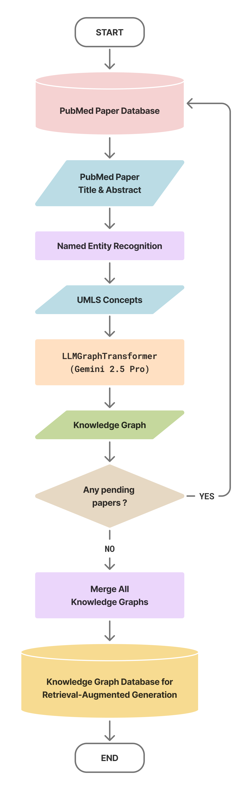
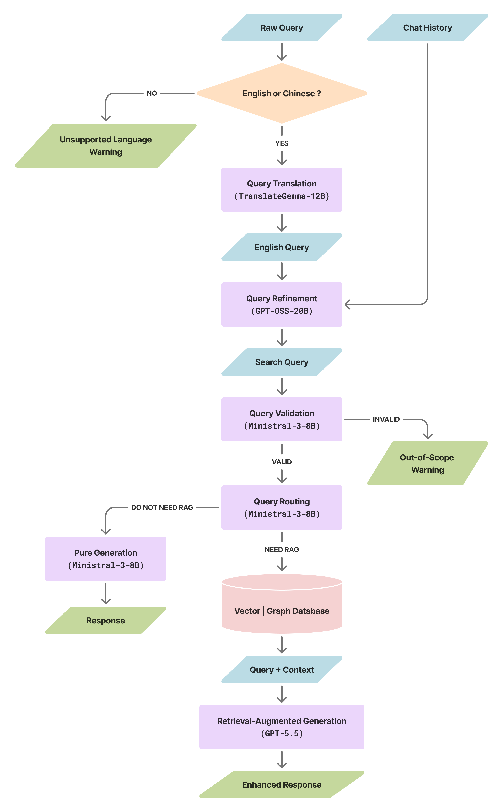

# PubMed Chatbot

A biomedical literature Q&A system combining **Text RAG** and **Graph RAG**, with support for both English and Traditional Chinese input. The system integrates UMLS concept linking, knowledge graph retrieval, and a multi-stage query processing pipeline powered by a diverse set of LLMs.

---

## System Architecture

### Knowledge Graph Construction



1. **Fetch PubMed Papers** — Retrieve titles and abstracts from PubMed by topic using PMIDs.
2. **Named Entity Recognition** — Extract biomedical entities from text using [scispaCy](https://allenai.github.io/scispacy/).
3. **UMLS Concept Linking** — Map recognized entities to standardized UMLS concepts (CUIs) for semantic grounding.
4. **Knowledge Graph Construction** — Use `LLMGraphTransformer` backed by **Gemini 2.5 Pro** to extract structured (subject, relation, object) triples from each paper.
5. **Merge into Graph Database** — Incrementally merge per-paper graphs into a unified knowledge graph stored as NetworkX `DiGraph` objects (`.graphml`).

---

### Chat Workflow



1. **Language Detection** — Detect the language of the raw query. Supports English and Traditional Chinese; other languages return a warning.
2. **Translation** (Chinese only) — Translate the query to English using **TranslateGemma-12B** (via Ollama).
3. **Query Refinement** — Rewrite the query into a clean search query using **GPT-OSS-20B** (via Ollama), conditioned on the chat history.
4. **Query Validation** — Filter out-of-scope queries (non-biomedical) using **Ministral-3-8B** (via Ollama).
5. **Query Routing** — Decide whether RAG retrieval is needed using **Ministral-3-8B** (via Ollama).
6. **RAG Path** (if retrieval needed):
   - Retrieve relevant chunks from **Vector DB** (ChromaDB + OpenAI embeddings).
   - Retrieve a subgraph from the **Graph DB** (NetworkX knowledge graphs) via UMLS concept linking.
   - Generate an enhanced response with retrieved context using **GPT-5.2** (or **GPT-4.1**) via the OpenAI API.
7. **Non-RAG Path** (if no retrieval needed): Generate a direct response using **Ministral-3-8B** (via Ollama).

---

## Large Data Files

The following directories are excluded from this repository due to file size limits. Download them from the link below and place them in the project root before running the application.

**Download link:** [https://eln.iis.sinica.edu.tw/lims/?q=zh-hant/node/8135](https://eln.iis.sinica.edu.tw/lims/?q=zh-hant/node/8135)

| Directory | Description |
|---|---|
| `chroma_db/` | ChromaDB vector database (built by `build_vector_dbs.py`) |
| `umls_2025ab/` | UMLS 2025AB concept data, TF-IDF vectors, and NMSLib index |
| `nodes/` | Knowledge graph node JSON files per topic |
| `edges/` | Knowledge graph edge JSON files per topic |
| `knowledge_graphs/` | Merged GraphML knowledge graph files per topic |
| `pubmed_papers/` | Downloaded PubMed paper JSON files per topic |

---

## Installation & Setup

### 1. Create and activate a Conda environment

```bash
conda create -n pubmed-chatbot python=3.11.14 -y
conda activate pubmed-chatbot
```

### 2. Install Python dependencies

Install PyTorch with CUDA support first (adjust the CUDA version to match your system):

```bash
pip install torch==2.10.0+cu130 torchvision==0.25.0+cu130 \
    --extra-index-url https://download.pytorch.org/whl/cu130
```

Then install all remaining dependencies:

```bash
pip install -r requirements.txt
```

### 3. Install Ollama and pull required models

[Install Ollama](https://ollama.com/download), then pull the three local models:

```bash
ollama pull ministral-3:8b
ollama pull gpt-oss:20b
ollama pull translategemma:12b
```

### 4. Configure environment variables

Create a `.env` file in the project root:

```bash
OPENAI_API_KEY=your_openai_api_key_here
```

### 5. Place downloaded data files

Extract the downloaded archive and place each directory (`chroma_db/`, `umls_2025ab/`, `nodes/`, `edges/`, `knowledge_graphs/`, `pubmed_papers/`) into the project root.

---

## Usage

Start the Streamlit application:

```bash
streamlit run streamlit_app.py
```

The app will be available at `http://localhost:8087`.

### Rebuilding databases from scratch

If you want to rebuild the databases yourself instead of downloading them:

```bash
# 1. Download PubMed papers
python pubmed_papers.py

# 2. Build knowledge graphs (requires Gemini API access via google_credentials.json)
python build_graph_dbs.py

# 3. Build node/edge JSON files
python build_nodes_dbs.py

# 4. Build ChromaDB vector database
python build_vector_dbs.py

# 5. Build UMLS abbreviation database
python build_abbreviation_db.py

# 6. Build UMLS NMSLib index (inside umls_2025ab/)
python umls_2025ab/create_linker.py
```

---

## Project Structure

```
PubMed_Chatbot/
├── streamlit_app.py              # Main Streamlit UI entry point
├── streamlit_functions.py        # Streamlit resource loading helpers
├── chatbot.py                    # Core chatbot logic and response generation
├── graph_construction.py         # Knowledge graph construction pipeline
├── graph_data_retrieval.py       # Subgraph retrieval for Graph RAG
├── graph_visualization.py        # Interactive graph HTML rendering
├── graph_evaluation.py           # Graph construction evaluation utilities
├── pubmed_papers.py              # PubMed paper fetching utilities
├── umls_concept_linking.py       # UMLS concept linking via NMSLib + TF-IDF
├── query_refinement.py           # Query rewriting with GPT-OSS-20B
├── query_validation.py           # Out-of-scope query filtering
├── query_routing.py              # RAG vs. pure generation routing
├── query_abbreviation_expansion.py # Biomedical abbreviation expansion
├── translation.py                # Chinese ↔ English translation
├── build_abbreviation_db.py      # Build abbreviation lookup database
├── build_graph_dbs.py            # Build knowledge graph databases
├── build_nodes_dbs.py            # Build node JSON databases
├── build_vector_dbs.py           # Build ChromaDB vector databases
├── datasets/                     # Static configuration JSON files
├── prompts/                      # LLM prompt templates
├── lib/                          # Frontend JS/CSS libraries (vis.js, tom-select)
├── imgs/                         # Architecture diagrams
└── umls_2025ab/                  # UMLS data and index scripts
```
